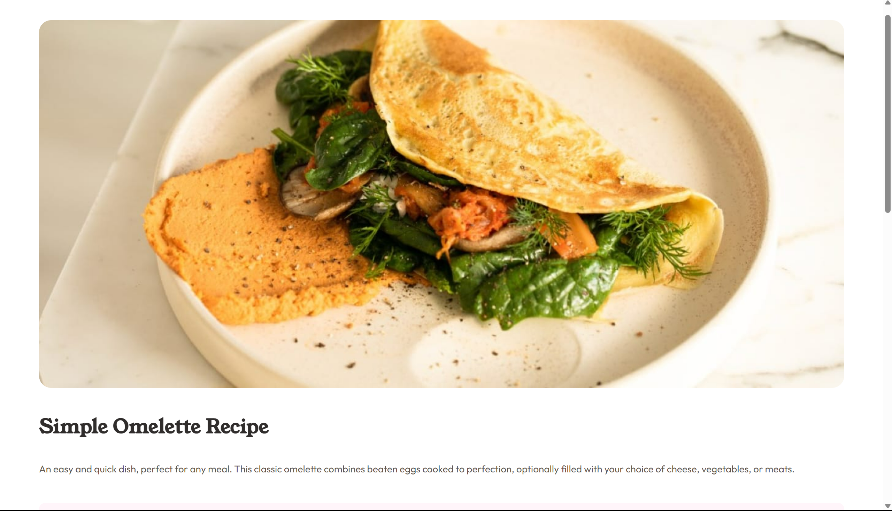
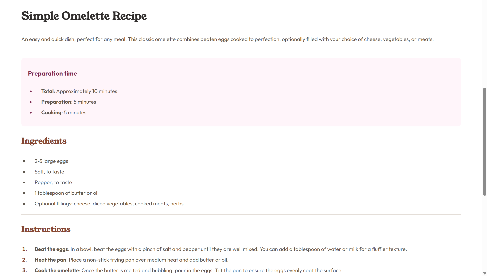
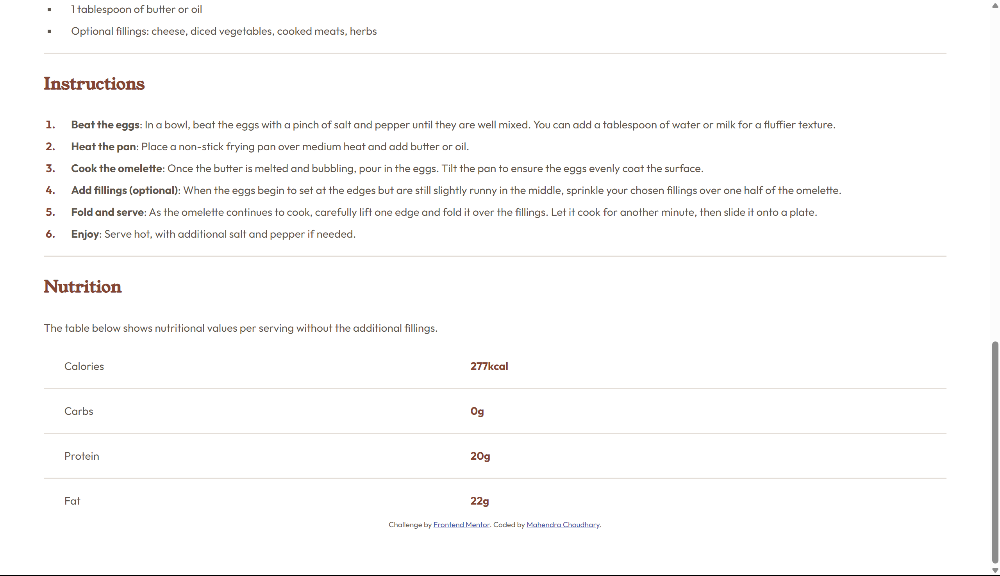

# Frontend Mentor - Recipe page solution

This is a solution to the [Recipe page challenge on Frontend Mentor](https://www.frontendmentor.io/challenges/recipe-page-KiTsR8QQKm). Frontend Mentor challenges help you improve your coding skills by building realistic projects. 

## Table of contents

- [Overview](#overview)
  - [Screenshot](#screenshot)
  - [Links](#links)
- [My process](#my-process)
  - [Built with](#built-with)
  - [What I learned](#what-i-learned)
  - [Useful resources](#useful-resources)
- [Author](#author)


## Overview

### Screenshot






### Links

- Solution URL: (https://github.com/Mahendra030/Frontend-Mentor-Recipe-page-Solution)
- Live Site URL: 

## My process

### Built with

- Semantic HTML5 markup
- CSS custom properties
- [Fonts](https://fonts.google.com)


### What I learned

I have recently started learning web development and just completed intermediate html and css. This was my first practice question on Frontend Mentor. I used the best my knowledge and skill to create the page. There was a lot to learn through this project. It helped me better my css skills and I get aware of more css properties related to tables. I also tried to add a responsive section which also required a bit of research.

```css
.instruction-box li::marker {
    color: hsl(14, 45%, 36%);
    font-weight: 700;
}

@media (max-width: 500px) {
    body {
        margin: 2rem;
    }
}
```


### Useful resources

- [Resource 1 - [Fonts]](https://fonts.google.com) - There are of amazing fonts to work with in your websites.
- [Resource 2 - [Mdn Web Docs]](https://developer.mozilla.org) - This is an amazing website which helped me finally understand responsive code. I'd recommend it to anyone still learning this concept.


## Author

- Mahendra Choudhary
